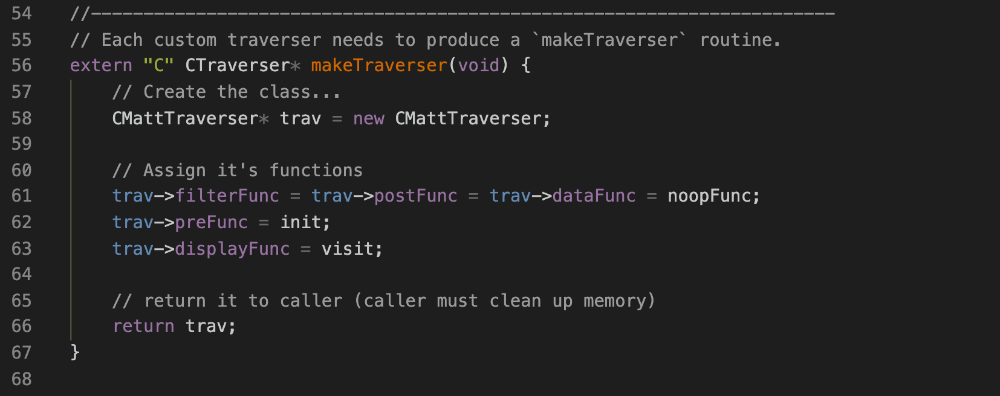

# Custom Taverser for Compound

## Introduction

This is an example of using TrueBlocks to query a very specific value from a smart contract after every transaction that that smart contract was involved in.

In this example, we will use the Compound DAI address. We can confirm that name with this `chifra` command:

```[shell]
> chifra names 0x5d3a536E4D6DbD6114cc1Ead35777bAB948E3643
```

which returns this:

| tags        | address           | name         | symbol | decimals |
| ----------- | ----------------- | ------------ | ------ | -------- |
| 36-Compound | 0x5d3a53...8e3643 | Compound Dai | cDAI   | 8        |

## Listing Transactions

Next, we can extract from the TrueBlocks index a list of every transaction that the Compound DAI address has ever been involved in:

```[shell]
> chifra list 0x5d3a536E4D6DbD6114cc1Ead35777bAB948E3643
```

This produces (after downloading the index chunks) a list of more than 800,000 records (at the time of this writing). Note that at this point, we've put no additional data on the machine we're using. This is one of the benefits of TrueBlocks. It only extracts data when it has to.

## The Code for a Custom Traverser

Next, we need to write some code (see [matt.cpp](./matt.cpp)).

The first routine we need is called `makeTraverser`. Every custom TrueBlocks traverser must provide this function as it is the entry point into the custom traverser called by `chifra export` (we'll explain this below).



This routine creates a new traverser, attaches a few functions to the hooks on the traverser class and returns the result to its caller.

Traversers have six hooks onto which you may attach your own code. We show that code below. Prior to displaying any of the address's transactions, the traverser will call its own `preFunc`. We've attach a function called `init` to the `preFunc`, which we show here:


This is a very simple routine that simple displays the header for the data that is about to be generated. You might generate headers for a comma-separated value file for example. Here we generated a tab-separated header. If we were generating JSON, we would skip this function.

The next routine we need is attached to the traverer's `displayFunc`. Here, we've called that function `visit` which we present next. The `displayFunc` is called once for every transaction that the given address appears in (that is, the list of transactions generated above).


In this routine, we first make a call into the smart contract's `exchangeRateStored` function (which has a four-byte of `0x182df0f5`). We load the ABI for the address (which we could have loaded in the `init` function) so that the function `getResults` knows how to decode the result.

After completing the call into the smart contract, we display the blockNumber, transactionIndex, date and result returned from the call into the contract.

One returns `'true'` from the hook routines to continue the traversal. At any point, you can return `'false'` to stop the traversal.

That's it. That the entire code for extracting a particular value from a smart contract at every place it ever appeared on the blockchain. I'm sure you'll appreciate just how complicate this can become and yet how simple it is to build your own customized traverser with TrueBlocks.

Fin.

## Building and Running Your Custom Traverser

To build the custom traverser, go to the command line in the present folder and run this command:

```[shell]
make
```

(Run `make -f make.mac` on a Mac.)

This will produce a file called `libmatt.so` (`libmatt.dylib` on mac) and copy it to the TrueBlocks cache.

To run the exporter with your custom traverser do this command:

```[shell]
chifra export --load libmatt.so <address>
```

This will produce a [file similar to this](./results.txt). Be careful though. There are more than 800,000 records, so make sure you have enough hard drive space.

## Conclusion

TrueBlocks provides a routine called `chifra export <address>`. Normally, the tool provides various ways of exporting data such as `--logs`, `--accounting`, `--factory`, etc. but sometimes you need the ability to extract very specific (or very detailed) data for a given address. Custom Traversers gives you the ability to do that in a very simple, very self contained way.
