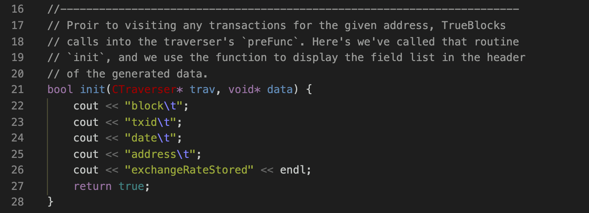

# Custom Taverser for Compound

## Introduciton

This is an example of using TrueBlocks to query a very specific value from a smart contract after every transaction that that smart contract was involved in.

In this example, we will use the Compound DAI address. We can confirm that name with this `chifra` command:

```[shell]
> chifra names 0x5d3a536E4D6DbD6114cc1Ead35777bAB948E3643
```

which returns this:

| tags        | address           | name         | symbol | decimals |
| ----------- | ----------------- | ------------ | ------ | -------- |
| 36-Compound | 0x5d3a53...8e3643 | Compound Dai | cDAI   | 8        |

## Listing Transactions

Next, we can extract from the TrueBlocks index a list of every transaction that the Compound DAI address has ever been involved in:

```[shell]
> chifra list 0x5d3a536E4D6DbD6114cc1Ead35777bAB948E3643
```

This produces (after downloading the index chunks) a list of more than 800,000 records (at the time of this writing). Note that at this point, we've put no additional data on the machine we're using. This is one of the benefits of TrueBlocks. It only extracts data when it has to.

## The Code for a Custom Traverser

Next, we need to write some code (see [matt.cpp](./matt.cpp)).

The first routine we need is called `makeTraverser`. Every custom TrueBlocks traverser must provide this function as it is the entry point into the custom traverser called by `chifra export` (we'll explain this below).


This routine creates a new traverser at line 58. At lines 51-63, we're attaching functions to the traverser's hooks. Line 66 returns the result to its caller.

The Traverser class has six hooks onto which you may attach your own functions. We show examples of two of those functions below.

The first, `preFunc` is called prior to displaying any of the address's transactions. At line 62 above, we've attached a function called `init`, which we show here:



This very simple routine writes the header for the data to the standard out (cout). Here, we're generating a header for a tab-separated export, but you could generate headers for a comma-separated value file if you wished. If we were generating JSON, we would skip this function. If you were writing to a file, you'd open the file here. If you were writing to a database, you'd establish the connection here.

The next routine we attach, at line 63 above, is to the traverer's `displayFunc`. We've called that function `visit` which we present next. The traverser's `displayFunc` is called once for each appearance for the address (i.e., the list of transactions generated above).


In the `visit` routine, we first make a call into the smart contract's `exchangeRateStored` function (which has a four-byte encoding of `0x182df0f5`). At line 43, we load the ABI for the address. We need the ABI, so that the function `getResults` knows how to decode call's result.

After completing the call into the smart contract, we display the blockNumber, transactionIndex, date and the result returned from the call into the contract.

For all hooks, if the function returns `'true'` fthe traverse continues. If, on the other hand, the function returns `'false'`, the traversal will stop.

The final peice of code is where we create a derived class from the base CTraverser class. In this example, we don't really need to customize this, but if you were writing to a file or a database, for example, this is where you would store the connection or FILE pointer. You could also use this class for keeping accumulators such as `totalGasSpent` or a balance history map.


That's it. That's the entire code for extracting a value from any smart contract at every one of its appearances on the chain.

Fin.

## Building and Running Your Custom Traverser

To build the custom traverser, first write its code as above. Then, go to the command line in the present folder and run this command:

```[shell]
make linux
```

(Run `make mac` on a Mac.)

This will produce a file called `libmatt.so` (`libmatt.dylib` on mac) and copy it to the TrueBlocks cache.

To run the exporter with your custom traverser, run this command:

```[shell]
chifra export --load libmatt.so <address>
```

The above command will print the results to the terminal. (We've captured the first few lines in [this file](./results.txt). Be careful though.

The `chifra export <address>` call is how people would normally interact with TrueBlocks. `chifra export` provides various built-in ways of exporting data (such as `--logs`, `--accounting`, `--factory`, etc.) but sometimes you need the ability to extract very specific details (or a combination of very specific details) for a given address. Custom Traversers gives you the ability to do that in a simple, very self-contained way.

## Conclusion

I hope you can appreciate the potential here. The constructor of the derived class and each hook can become as complicated as you wish, but at the same time, it's as simple as these 100 lines of code.
